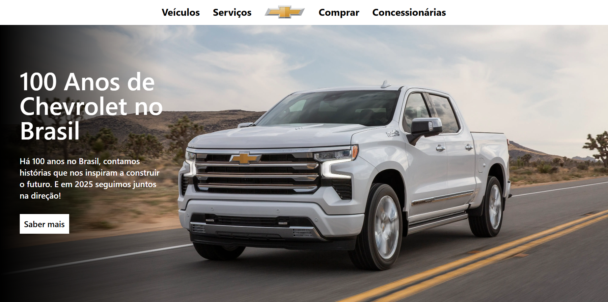

# Landing Page Chevrolet

Projeto de uma landing page comemorativa desenvolvida para destacar os 100 anos da Chevrolet no Brasil. O layout moderno e responsivo valoriza a identidade visual da marca, com foco em performance e experiência do usuário.

## viwer


## 🚀 Tecnologias Utilizadas

- HTML, CSS e JavaScript
- Tailwind CSS para estilização rápida e responsiva
- React para estruturação dos componentes

## 📌 Pré-requisitos

Antes de começar, certifique-se de ter os seguintes requisitos instalados:
- Navegador atualizado
- Editor de código (VS Code, Sublime, etc.)
- Node.js instalado (versão 16 ou superior recomendada)
- Git (opcional, para versionamento)

## 📦 Como Instalar e Executar

1. Clone o repositório:
```
git clone https://github.com/arthurpedr/chevrolet-landing-page.git
```
2. Acesse a pasta do projeto:
```
cd chevrolet-landing-page
```
3. Instale as dependências:
```
npm install
```
4. Inicie o servidor de desenvolvimento:
```
npm run dev
```
5. Acesse no navegador:
```
Exemplo: http://localhost:5173
```

## 📄 Estrutura do Projeto

```
/
├──> node_modules
├──> Public
├──> SRC - 
├──.gitignore
├── eslint.config.js
├── index.html
├── package-lock.json
├── package.json
├── README.md
└── vite.config.js
```

## 📌 Funcionalidades

✅ Projeto Responsivo

## ✨ Melhorias Futuras

 - Otimização da pagina

## 🛠️ Contribuição

1. Faça um fork do projeto.
2. Crie uma branch para sua feature:
```
git checkout -b minha-feature
```
3. Faça commit das suas alterações:
```
git commit -m 'Adicionando nova feature'
```
4. Envie para o repositório remoto:
```
git push origin minha-feature
```
5. Abra um **Pull Request** explicando o que foi feito.


## 📜 Licença

Este projeto está sob a licença MIT - veja o arquivo [LICENSE](LICENSE) para mais detalhes.

## 📞 Contato

📧 Email: pedroporteiras@gmail.com